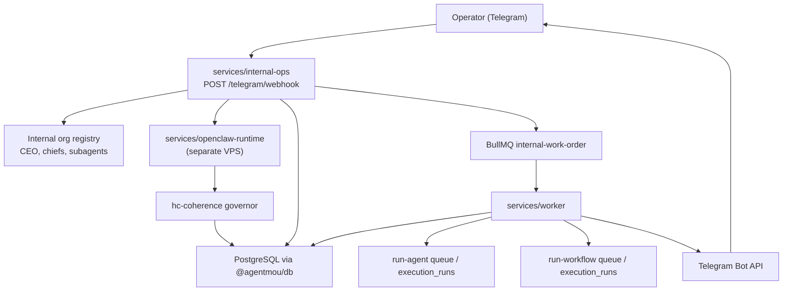

# Internal Ops Personal Operating System

This document is the canonical architecture reference for the private
multi-agent system that runs Agentmou itself. It describes the code that now
lives under `services/internal-ops`, the shared contracts and tables it uses,
and the way it plugs into the existing API, worker, and execution substrate.

## Scope

This subsystem is intentionally separate from tenant-facing product agents.

- It is a personal operating system for running Agentmou as a company through
  an internal org chart.
- Telegram is the only human operator interface.
- OpenClaw is the reasoning runtime.
- `hc-coherence` is the governance layer that validates real turn state before
  execution continues.
- The existing Agentmou tenant stack is optional execution substrate, not the
  defining architecture of the system.

## Architectural Boundaries

### What This System Is

- A Fastify service at `services/internal-ops`
- A deployable reasoning runtime at `services/openclaw-runtime`
- A set of shared contracts under `packages/contracts/src/internal-ops.ts`
- A persistence slice in `@agentmou/db`
- A worker-side execution path based on the `internal-work-order` queue
- A private org chart with internal agent profiles, relationships, memory,
  protocol artifacts, and Telegram message history

### What This System Is Not

- Not a tenant-facing catalog feature
- Not a generalized multi-tenant control plane
- Not a replacement for `services/api`
- Not a free-form automation shell with unrestricted access to the full product
  surface

## System Topology

## Core Components

### `services/internal-ops`

The internal-ops service is the control plane for the personal org chart.

Responsibilities:

- authenticate Telegram webhook traffic through a shared secret
- constrain operator access through chat and user allowlists
- bootstrap the internal registry
- create or resume objectives
- start or continue remote OpenClaw turns
- run `hc-coherence` on the returned execution snapshot
- persist delegations, protocol events, decisions, and work orders
- enqueue deterministic follow-up work for `services/worker`

### `services/openclaw-runtime`

`services/internal-ops/src/openclaw/openclaw-runner.ts` defines the typed HTTP
boundary and `services/openclaw-runtime` provides the deployable server behind
that boundary.

Supported remote operations:

- `registerAgentProfiles()`
- `registerCapabilities()`
- `startTurn()`
- `continueTurn()`
- `cancelObjective()`
- `fetchTrace()`

This keeps the control plane authoritative for governance and persistence while
allowing reasoning to run on a separate VPS boundary.

### `hc-coherence`

The internal orchestrator does not treat `hc-coherence` as a branding wrapper
around business messages. It stores two separate layers:

- an internal delegation envelope with
  `contract.system = "agentmou-internal-ops"`
- the official coherence artifacts generated from the real OpenClaw turn state

The official coherence artifacts are stored in `internal_protocol_events`:

- `alerts`
- `controlSequences`
- `controlResults`
- `governorDecision`
- `executionControls`

### `services/worker`

The worker owns execution. Internal ops does not directly perform side effects.

The internal worker path can:

- send Telegram messages
- create approval requests
- dispatch agent installations into `run-agent`
- dispatch workflow installations into `run-workflow`
- write native artifacts and memory summaries
- synchronize external execution outcomes back into the objective

### Optional Agentmou Execution Substrate

The personal operating system can call into the existing tenant substrate when a
capability is bound in `internal_capability_bindings`.

Supported target types:

- `native`
- `agent_installation`
- `workflow_installation`

If a requested Agentmou capability is not bound, the orchestrator degrades to a
native brief instead of pretending the external execution happened.

## Org Chart Model

The registry currently models an executive structure with chiefs and a first
wave of subagents.

| Agent             | Role                                                    |
| ----------------- | ------------------------------------------------------- |
| `ceo`             | Root objective owner and top-level router               |
| `chief-of-staff`  | Cross-functional coordination and follow-through        |
| `cto`             | Technical execution and engineering tradeoffs           |
| `engineering-ops` | Bounded engineering handoffs and execution briefs       |
| `cmo`             | Marketing and growth execution                          |
| `content-studio`  | Content and launch packaging                            |
| `coo`             | Internal coordination and delivery hygiene              |
| `ops-coordinator` | Follow-up routing and operating state                   |
| `cro`             | Revenue and commercial execution                        |
| `pipeline-ops`    | Pipeline maintenance and CRM-oriented work              |
| `cfo`             | Financial control and review                            |
| `finance-ops`     | Finance summaries, ledger coordination, and review prep |

Each profile carries:

- mission
- KPIs
- allowed tools
- allowed capabilities
- memory scope
- risk budget
- participant budget
- maximum delegation depth
- escalation policy
- playbooks

The registry is persisted to `internal_agent_profiles` and
`internal_agent_relationships` and also registered with the OpenClaw runtime.

## Turn Lifecycle

### 1. Telegram ingress

`POST /telegram/webhook` accepts either:

- a normal Telegram message, or
- an inline-button callback query

Inbound messages are deduplicated in `internal_telegram_messages` by a
`dedupeKey` such as `telegram:update:<update_id>`.

### 2. Session and objective creation

For a new operator message, the service:

- resolves or creates a Telegram conversation session
- records the inbound Telegram message
- creates a root `execution_runs` row
- creates a new internal objective owned by `ceo`

### 3. OpenClaw turn input

The service builds an `OpenClawTurnInput` using:

- the tenant id
- session id
- objective id
- the current active agent id
- the operator message
- the full internal registry
- the internal capability catalog
- up to eight recent structured memory entries for the objective

### 4. OpenClaw turn result

The remote runtime returns an `OpenClawTurnResult` containing:

- summary
- current active agent
- objective status
- delegations
- work orders
- operator messages
- participants
- context channels
- tool-call names
- success count
- retry count
- checkpoint token
- trace reference

### 5. Coherence governance

The orchestrator converts the turn result into an `ExecutionSnapshot` and runs
the `hc-coherence` cycle. The governor can cause:

- continued execution
- bounded rerun behavior
- pause / review
- escalation

If coherence demands review and the turn did not already create a
`request_human_approval` work order, the service synthesizes one.

### 6. Delegation and work-order persistence

Delegations are stored in `internal_delegations` with a business envelope that
includes:

- sender and recipient
- action requested
- expected artifacts
- capability keys
- execution target
- parent delegation linkage
- summarized coherence state

Work orders are stored in `internal_work_orders` with explicit execution
targets:

- `native`
- `agent_installation`
- `workflow_installation`
- `telegram`

### 7. Worker execution

`services/worker` consumes `internal-work-order` jobs and executes the
appropriate handler:

- `prepare_artifact`
- `run_agent_installation`
- `run_workflow_installation`
- `request_human_approval`
- `sync_internal_state`
- `notify_telegram`

### 8. Approvals and resumption

When a work order needs approval, the worker:

- creates an `approval_requests` row
- moves the work order, objective, and session into `waiting_approval`
- creates a `notify_telegram` work order with signed inline buttons

Callbacks from Telegram are HMAC-signed using
`INTERNAL_OPS_CALLBACK_SECRET`. Approvals can:

- approve and resume the exact blocked work order
- reject and cancel the objective
- postpone and keep the objective in waiting state
- reformulate and continue the OpenClaw turn with an approval intent

### 9. Objective closure and memory

When all work orders settle, the worker:

- marks the objective and root execution run complete or failed
- writes a structured memory summary to `internal_memory_entries`
- queues a Telegram summary message if one has not already been queued

## Persistence Model

The internal operating system adds its own relational memory instead of
depending on vector search.

| Table                            | Purpose                                                                     |
| -------------------------------- | --------------------------------------------------------------------------- |
| `internal_agent_profiles`        | Internal org chart nodes                                                    |
| `internal_agent_relationships`   | Parent/child links between internal agents                                  |
| `internal_conversation_sessions` | Telegram-backed operator sessions                                           |
| `internal_objectives`            | Objective state, owner, root run, and coherence summary                     |
| `internal_delegations`           | Agent-to-agent delegations and responses                                    |
| `internal_work_orders`           | Typed execution intents for worker processing                               |
| `internal_decisions`             | Decision log for approval, blocking, and completion outcomes                |
| `internal_artifacts`             | Briefs, summaries, handoffs, Telegram deliveries, and execution summaries   |
| `internal_protocol_events`       | OpenClaw turn records, business envelopes, and official coherence artifacts |
| `internal_memory_entries`        | Structured memory across session, objective, and agent scopes               |
| `internal_openclaw_sessions`     | Bound remote OpenClaw session state and trace references                    |
| `internal_telegram_messages`     | Inbound/outbound Telegram ledger and dedupe keys                            |
| `internal_capability_bindings`   | Tenant-scoped capability bindings into Agentmou installations               |

## Capability Binding Model

The capability registry has two layers:

1. Global capability definitions in `src/org-registry.ts`
2. Tenant-scoped bindings in `internal_capability_bindings`

Current capability groups:

- native internal capabilities such as brief preparation, approval requests,
  and state sync
- optional Agentmou-backed capabilities for engineering, marketing, sales, and
  finance

The default bootstrap only inserts native bindings. External Agentmou
capabilities must be bound to an existing `agent_installations` or
`workflow_installations` row before OpenClaw work orders can dispatch into the
main platform runtime.

## Telegram Model

Telegram is the single human surface for this subsystem.

Outbound message modes:

- `ack`
- `status`
- `approval`
- `summary`
- `callback`

The worker sends outbound messages through the Telegram Bot API and records the
result in both `internal_telegram_messages` and `internal_artifacts`.

## Current Deployment Shape

The intended deployment model is hybrid:

- `services/internal-ops` lives in this monorepo and owns persistence plus
  governance
- the OpenClaw runtime is remote and addressed through `OPENCLAW_API_URL`
- the worker, DB, queues, and optional Agentmou tenant substrate remain part of
  the main platform stack

Important current state:

- there is no checked-in OpenClaw server implementation in this repo
- there is no dedicated Docker Compose service for `services/internal-ops` yet
- the internal tenant substrate is optional and capability-bound, not globally
  exposed

## Related Docs

- [Internal Ops Service README](../../services/internal-ops/README.md)
- [Internal Ops Runbook](../runbooks/internal-ops-operations.md)
- [AI Surfaces](./ai-surfaces.md)
- [ADR-010: Personal Internal Ops Runtime](../adr/010-personal-internal-ops-runtime.md)
