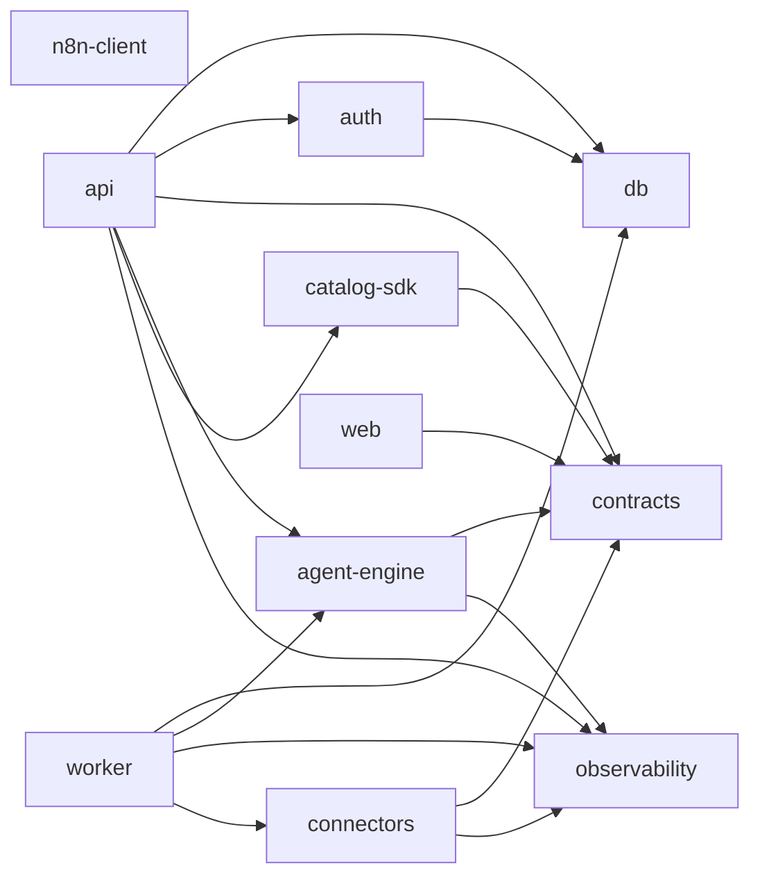

# Monorepo Map

This document describes the real repository layout and the role of each area.

## Root Structure

```text
agentmou-platform/
├─ apps/
│  └─ web/
├─ services/
│  ├─ api/
│  └─ worker/
├─ packages/
│  ├─ agent-engine/
│  ├─ auth/
│  ├─ catalog-sdk/
│  ├─ connectors/
│  ├─ contracts/
│  ├─ db/
│  ├─ n8n-client/
│  ├─ observability/
│  └─ ui/
├─ catalog/
├─ workflows/
├─ infra/
├─ docs/
├─ whole-initial-context.md
├─ turbo.json
├─ pnpm-workspace.yaml
├─ eslint.config.js
└─ package.json
```

## Apps

- `apps/web`
  - Role: marketing site + tenant control plane UI.
  - Tech: Next.js 16, React 19, Tailwind v4, Radix/shadcn.
  - Status: aligned with target architecture; consumes types from
    `@agentmou/contracts`.

## Services

- `services/api`
  - Role: control plane API (tenants, catalog, installations, connectors,
    runs, approvals, security, billing, webhooks, n8n adapter).
  - Status: module structure in place; services are placeholder/stub.

- `services/worker`
  - Role: background execution (install, run, schedule, approvals, ingest).
  - Status: job taxonomy matches target; implementations are scaffold.

## Shared Packages

- `packages/contracts`
  - Role: shared Zod schemas and TypeScript types for all domain entities.
  - Status: **comprehensive** — covers catalog, tenancy, installations,
    execution, approvals, connectors, security, billing, dashboard.

- `packages/db`
  - Role: Drizzle ORM schema + Postgres client.
  - Status: **full domain schema** — users, tenants, memberships,
    connector_accounts, secret_envelopes, agent_installations,
    workflow_installations, execution_runs, execution_steps,
    approval_requests, audit_events, usage_events.

- `packages/catalog-sdk`
  - Role: parse/validate catalog manifests (agents, packs, workflows).
  - Status: schemas aligned with actual manifest files.

- `packages/agent-engine`
  - Role: runtime engine (planner, policies, tools, memory, workflow
    dispatch, approvals, logging, templates).
  - Status: shape present; behavior is placeholder.

- `packages/connectors`
  - Role: connector abstractions and registry.
  - Status: bootstrap scaffold with Gmail connector stub.

- `packages/n8n-client`
  - Role: n8n REST API adapter.
  - Status: scaffold with n8n-specific types.

- `packages/auth`
  - Role: JWT + session helpers.
  - Status: scaffold (JWT real, sessions in-memory).

- `packages/observability`
  - Role: structured logging (Pino) and trace ID generation.
  - Status: scaffold.

- `packages/ui`
  - Role: shared UI components (placeholder).
  - Status: minimal; shared UI components live in `apps/web/components/ui/`
    following the shadcn co-location pattern.

## Package Dependency Graph



## Catalog and Workflow Assets

- `catalog/`
  - Versioned agent and pack manifests.
  - Currently: `inbox-triage` agent, `support-starter` and
    `sales-accelerator` packs.

- `workflows/public/` and `workflows/planned/`
  - Versioned workflow artifacts with manifests, n8n definitions, and
    fixtures.
  - Currently: `wf-01-auto-label-gmail` (public), `wf-plan-rag-kb-answer`
    (planned).

## Infrastructure

- `infra/compose/` — local and prod Docker Compose files.
- `infra/scripts/` — `setup.sh`, `backup.sh`.
- `infra/traefik/` — Traefik config.

## Tooling

- `pnpm` workspaces (`apps/*`, `services/*`, `packages/*`).
- `turbo` task orchestration.
- ESLint flat config at root (`eslint.config.js`).
- Prettier at root (`.prettierrc`).
- TypeScript baseline (`tsconfig.base.json`).

## Source-of-Truth Planning File

- [`whole-initial-context.md`](../../whole-initial-context.md) is the
  architecture and direction reference.
