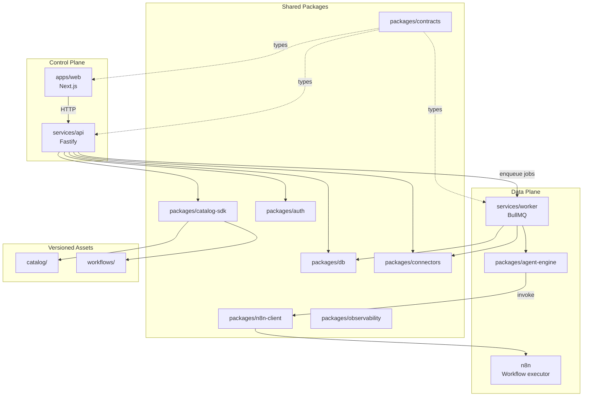

# Architecture Overview

This repository currently follows the code-verified architecture context in
[`platform-context-v2.md`](./platform-context-v2.md).

[`whole-initial-context.md`](../../whole-initial-context.md) remains the
historical baseline for the original proposal and direction.

The high-level architecture still centers on:

- One monorepo.
- One product.
- Two logical planes.
  - Control Plane: web app + API + tenant-facing configuration/state.
  - Data Plane: worker + agent runtime + workflow execution.
- Catalog and workflow assets versioned in-repo.
- Shared contracts (`@agentmou/contracts`) as the single type source of
  truth across all workspaces ([ADR-002](../adr/002-shared-contracts-type-system.md)).

## Current Architecture Documents

- [Platform Context v2.0](./platform-context-v2.md)
- [Monorepo Map](./monorepo-map.md)
- [Current Implementation vs Target Plan](./current-implementation.md)
- [Web App (`apps/web`) Architecture](./apps-web.md)
- [Engineering Conventions](./conventions.md)
- [Refactor Log — initial (2026-03-08)](./refactor-log-2026-03-08.md)
- [Refactor Log — contracts elevation (2026-03-08)](./refactor-log-2026-03-08-contracts.md)
- [Refactor Log — Phase 1 control plane (2026-03-08)](./refactor-log-2026-03-08-phase1.md)

## Reality Check

The repository now has:

- Correct top-level structure aligned with the target plan.
- `apps/web` consumes domain types from `@agentmou/contracts`.
- `packages/db` schema covers the full domain model (tenants, memberships,
  installations, runs, steps, approvals, audit, schedules, OAuth state).
- `packages/catalog-sdk` validates actual manifest files correctly.
- `pnpm typecheck` passes on the March 17, 2026 validation snapshot.

The platform remains in bootstrap stage for backend runtime maturity:

- `services/api` and `services/worker` now contain a real vertical slice,
  but several tenant-facing modules are still stubbed or partial.
- Shared contracts exist, but producer payloads are not yet consistently
  aligned with them across API, worker, and web.
- `pnpm test` is not currently green in a clean checkout; see
  [Platform Context v2.0](./platform-context-v2.md) for the exact failure.

Use the linked documents above as the authoritative map of what is real
today and what is next.
