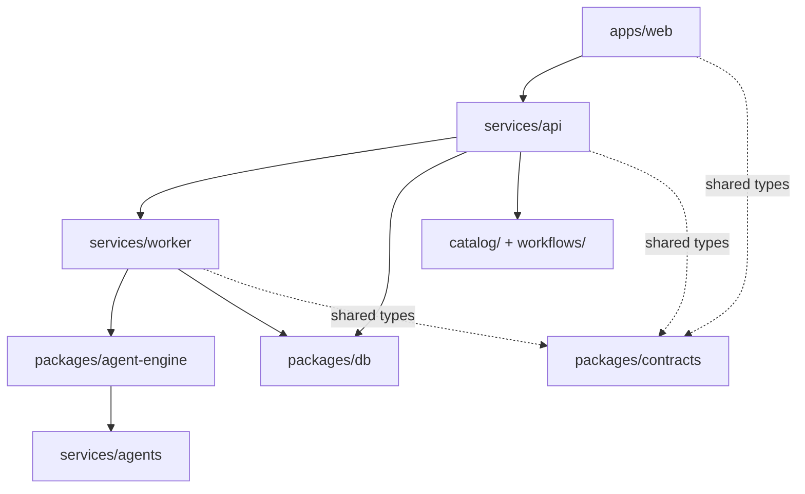

# Architecture Overview

Use this page as the short architecture landing page. It points to the
canonical document for each topic instead of duplicating the same explanation
across multiple files.

## System Shape

- One monorepo
- One product
- Two logical planes:
  - Control plane: `apps/web` plus `services/api`
  - Data plane: `services/worker`, `packages/agent-engine`, and n8n-backed
    workflow execution
- Versioned assets live in `catalog/` and `workflows/`
- Shared contracts in `@agentmou/contracts` provide the cross-workspace type
  vocabulary

## Canonical Docs

- [Current State](./current-state.md) for the code-verified repository and
  operations snapshot
- [Repository Map](../repo-map.md) for the workspace layout
- [Web App Architecture](./apps-web.md) for the current `apps/web` structure
- [Engineering Conventions](./conventions.md) for repo-wide implementation
  rules
- [ADRs](../adr/) for hard-to-reverse architectural decisions
