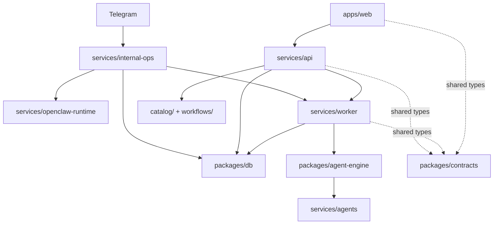

# Architecture Overview

Use this page as the short architecture landing page. It points to the
canonical document for each topic instead of duplicating the same explanation
across multiple files.

## System Shape

- One monorepo
- One product
- Three operational surfaces:
  - Product control plane: `apps/web` plus `services/api`
  - Personal internal ops plane: `services/internal-ops`,
    `services/openclaw-runtime`, and the Telegram operator interface
  - Data plane: `services/worker`, `packages/agent-engine`, and n8n-backed
    workflow execution
- Versioned operational assets live in `catalog/` and `workflows/`, then map to
  UI catalog contracts through `services/api`
- Shared contracts in `@agentmou/contracts` provide the cross-workspace type
  vocabulary

## Canonical Docs

- [Current State](./current-state.md) for the code-verified repository and
  operations snapshot
- [AI Surfaces](./ai-surfaces.md) for workflow vs product-agent vs
  developer-agent boundaries
- [Internal Ops Personal Operating System](./internal-ops-personal-os.md) for
  the private Telegram/OpenClaw company-operations layer
- [Template Library](../template-library.md) for non-installable skeletons and
  promotion rules
- [Repository Map](../repo-map.md) for the workspace layout
- [Web App Architecture](./apps-web.md) for the current `apps/web` structure
- [Engineering Conventions](./conventions.md) for repo-wide implementation
  rules
- [ADRs](../adr/) for hard-to-reverse architectural decisions
