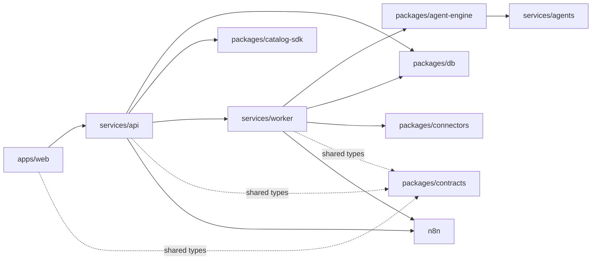

# Repository Map

This document describes the current repository layout, the job of each area,
and where to look first when you need to make a change.

## Root Structure

```text
agentmou-platform/
├─ apps/
│  └─ web/                  # Next.js public site + tenant control plane
├─ services/
│  ├─ agents/               # Python FastAPI helper service
│  ├─ api/                  # Fastify control-plane API
│  └─ worker/               # BullMQ workers
├─ packages/                # Shared internal libraries
├─ catalog/                 # Versioned agent and pack manifests
├─ workflows/               # Versioned workflow definitions
├─ infra/                   # Compose files, deploy scripts, backups, Traefik
├─ docs/                    # Canonical docs, runbooks, ADRs, and planning
├─ scripts/                 # Repo-level automation and helper scripts
├─ turbo.json
├─ pnpm-workspace.yaml
└─ package.json
```

## Workspace Groups

### `apps/`

- `apps/web`
  - Role: public marketing site plus authenticated tenant UI.
  - Main dependencies: `@agentmou/contracts`, the control-plane API, and local
    provider abstractions under `lib/data/`.

### `services/`

- `services/api`
  - Role: HTTP control plane for auth, tenants, catalog, installations,
    connectors, runs, approvals, public chat, and n8n operations.
  - Important directories: `src/modules/`, `src/routes/`, `src/lib/`.

- `services/worker`
  - Role: BullMQ jobs for installation, execution, scheduling, approvals, and
    future ingestion paths.
  - Important directories: `src/jobs/`, `src/lib/`.

- `services/agents`
  - Role: narrow Python service for LLM-backed email analysis and deep health
    checks.

### `packages/`

- `packages/contracts`
  - Shared Zod schemas and inferred types used across the monorepo.
- `packages/db`
  - Drizzle schema, DB client, migrations, and seed utilities.
- `packages/queue`
  - Shared queue names and typed payloads between API and worker.
- `packages/catalog-sdk`
  - Manifest loading and repo-root discovery for `catalog/` and `workflows/`.
- `packages/agent-engine`
  - Runtime planning, policies, tools, and execution helpers.
- `packages/connectors`
  - Connector abstractions and provider implementations such as Gmail.
- `packages/auth`
  - JWT and password hashing helpers.
- `packages/n8n-client`
  - Thin adapter over the n8n REST API.
- `packages/observability`
  - Logging and tracing helpers.
- `packages/ui`
  - Minimal shared UI package; most current UI components still live in
    `apps/web/components/ui/`.

## Runtime Flow



## Assets And Operations

- `catalog/`
  - Installable agent and pack manifests. The live catalog currently includes
    the `inbox-triage` agent and packs such as `support-starter`.
- `workflows/`
  - Public and planned workflow manifests plus n8n workflow JSON.
- `infra/compose/`
  - Local and production Docker Compose definitions plus `.env.example`.
- `infra/scripts/`
  - Canonical setup, deploy, smoke-test, backup, and cleanup scripts.
- `infra/traefik/`
  - Persistent certificate storage used by the production Traefik container.

## Documentation Layout

- `docs/architecture/` for current architecture, conventions, and focused
  subsystem docs.
- `docs/runbooks/` for operational procedures.
- `docs/planning/` for the active roadmap only.

## Related Docs

- [Documentation Hub](./README.md)
- [Architecture Overview](./architecture/overview.md)
- [Current State](./architecture/current-state.md)
- [Infrastructure Overview](../infra/README.md)
