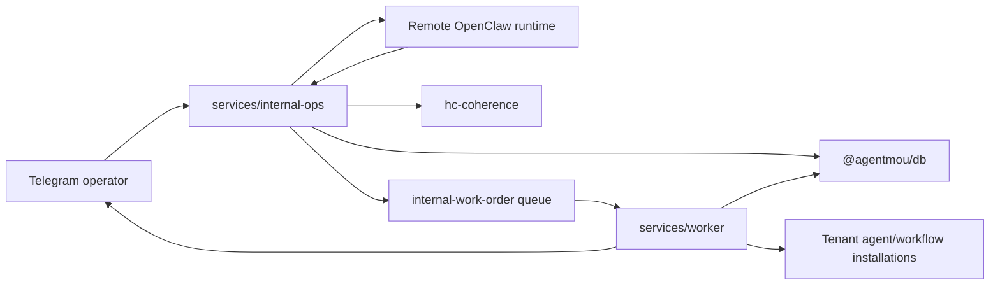

# @agentmou/internal-ops

Personal internal operating system for running AgentMou through a Telegram
operator interface, a remote OpenClaw runtime, and worker-driven execution.

## Purpose

`services/internal-ops` is the private control plane for AgentMou's own company
operations. It is not a tenant-facing product surface. The service receives
Telegram updates, turns them into internal objectives, asks a remote OpenClaw
runtime to plan the next turn, validates the turn through `hc-coherence`,
persists the resulting delegations and work orders, and lets the existing
worker execute the deterministic parts.

## Responsibilities

- Accept Telegram webhook updates and callback queries.
- Enforce webhook secret validation plus operator allowlists.
- Bootstrap and persist the internal agent registry for the personal org chart.
- Start or continue remote OpenClaw turns for each objective.
- Persist official `hc-coherence` artifacts alongside an internal delegation
  envelope for auditability.
- Translate OpenClaw output into typed internal work orders.
- Reuse the main platform worker, approval system, execution runs, and optional
  tenant-installed AgentMou assets.

## How It Fits Into The System



The service governs internal company objectives. It does not directly execute
side effects. It emits typed work orders and lets `services/worker` handle
Telegram delivery, approval gating, and any optional handoff into the product
execution substrate.

## HTTP Surface

| Route                                           | Purpose                                                                    |
| ----------------------------------------------- | -------------------------------------------------------------------------- |
| `GET /health`                                   | Liveness check                                                             |
| `POST /telegram/webhook`                        | Telegram inbound updates and inline-button callbacks                       |
| `POST /internal/approvals/:approvalId/callback` | Internal callback surface used to resume or reformulate blocked objectives |

## Key Entry Points

This service is not intended to be consumed as a general-purpose library, but
the main programmatic surfaces are:

| Surface               | Purpose                                                                         |
| --------------------- | ------------------------------------------------------------------------------- |
| `buildApp()`          | Construct the Fastify application for tests or embedding                        |
| `InternalOpsService`  | Main orchestration service for Telegram, OpenClaw turns, and work-order fan-out |
| `HttpOpenClawAdapter` | Typed HTTP client for the remote OpenClaw runtime                               |

## Main Source Files

| Path                                       | Role                                                                                 |
| ------------------------------------------ | ------------------------------------------------------------------------------------ |
| `src/app.ts`                               | Fastify app construction and route registration                                      |
| `src/orchestrator/internal-ops.service.ts` | Main orchestration service, Telegram entrypoint, turn persistence, and queue fan-out |
| `src/openclaw/openclaw-runner.ts`          | Typed HTTP adapter for the remote OpenClaw runtime                                   |
| `src/coherence/runtime.ts`                 | `hc-coherence` snapshot creation and governor loop                                   |
| `src/org-registry.ts`                      | Internal org chart, default capabilities, and default native bindings                |
| `src/routes/telegram.routes.ts`            | Telegram webhook route                                                               |
| `src/routes/internal.routes.ts`            | Internal approval callback route                                                     |

## Turn Lifecycle

1. Telegram sends a webhook update to `POST /telegram/webhook`.
2. `InternalOpsService` validates the secret token, operator allowlist, and
   deduplication key.
3. The service resolves or creates a Telegram-backed conversation session.
4. It creates a new internal objective owned by `ceo` and a root
   `execution_runs` row.
5. It builds an `OpenClawTurnInput` from the session, objective, internal
   registry, capability catalog, and recent structured memory.
6. The remote OpenClaw runtime returns delegations, work orders, operator
   messages, participants, tool-call traces, and checkpoint metadata.
7. The service converts that runtime state into an `ExecutionSnapshot`, runs
   the `hc-coherence` governor loop, and stores the resulting artifacts in
   `internal_protocol_events`.
8. The service persists internal delegations plus typed work orders.
9. `services/worker` consumes `internal-work-order` jobs and either:
   - sends Telegram messages,
   - requests approval,
   - creates a brief or state artifact,
   - dispatches a tenant agent installation, or
   - dispatches a tenant workflow installation.
10. External execution results are synchronized back into the objective and the
    operator receives status or summary messages in Telegram.

## Configuration

Important environment variables:

| Variable                                 | Purpose                                                                                             |
| ---------------------------------------- | --------------------------------------------------------------------------------------------------- |
| `INTERNAL_OPS_TENANT_ID`                 | Internal tenant used to persist sessions, objectives, work orders, and optional capability bindings |
| `INTERNAL_OPS_TELEGRAM_BOT_TOKEN`        | Bot token used for `answerCallbackQuery` and outbound Telegram messages (worker also requires it)   |
| `INTERNAL_OPS_TELEGRAM_WEBHOOK_SECRET`   | Secret token expected in `x-telegram-bot-api-secret-token`                                          |
| `INTERNAL_OPS_CALLBACK_SECRET`           | HMAC secret for approval button callback payloads                                                   |
| `INTERNAL_OPS_TELEGRAM_ALLOWED_CHAT_IDS` | Optional comma-separated allowlist for Telegram chats                                               |
| `INTERNAL_OPS_TELEGRAM_ALLOWED_USER_IDS` | Optional comma-separated allowlist for Telegram users                                               |
| `OPENCLAW_API_URL`                       | Base URL of the remote OpenClaw runtime                                                             |
| `OPENCLAW_API_KEY`                       | Optional bearer token for the OpenClaw runtime                                                      |
| `OPENCLAW_TIMEOUT_MS`                    | Timeout for OpenClaw HTTP calls; defaults to `15000`                                                |
| `PORT`                                   | HTTP port; defaults to `3002`                                                                       |
| `HOST`                                   | Bind host; defaults to `0.0.0.0`                                                                    |
| `LOG_LEVEL`                              | Fastify logger level                                                                                |
| `DATABASE_URL`                           | PostgreSQL connection via `@agentmou/db`                                                            |
| `REDIS_URL`                              | Queue transport for publishing `internal-work-order` jobs                                           |

See [`../../infra/compose/.env.example`](../../infra/compose/.env.example) for
the shared environment example.

## Local Usage

Run in watch mode:

```bash
pnpm --filter @agentmou/internal-ops dev
```

Build and run the compiled service:

```bash
pnpm --filter @agentmou/internal-ops build
pnpm --filter @agentmou/internal-ops start
```

Health check:

```bash
curl http://localhost:3002/health
```

## Development

```bash
pnpm --filter @agentmou/internal-ops typecheck
pnpm --filter @agentmou/internal-ops test
pnpm --filter @agentmou/internal-ops build
```

## Current Boundaries

- This service expects a remote OpenClaw runtime. No OpenClaw server is
  implemented inside this repo today.
- Default capability bindings are native-only. AgentMou-backed capabilities
  require rows in `internal_capability_bindings`.
- Telegram is the human operator surface. The internal callback route is a
  system surface, not the intended human entrypoint.

## Related Docs

- [AI Surfaces](../../docs/architecture/ai-surfaces.md)
